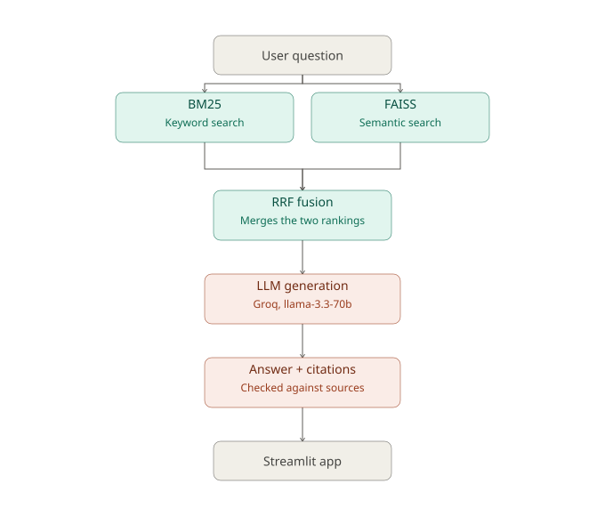
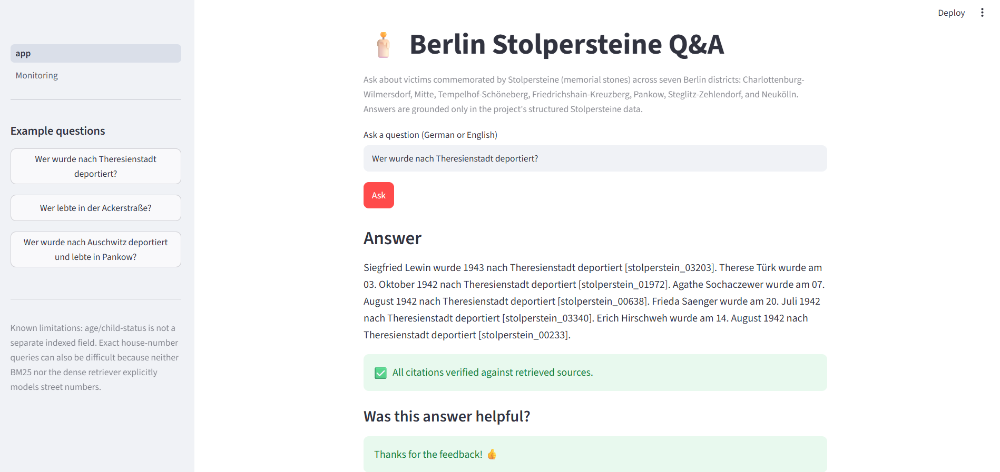
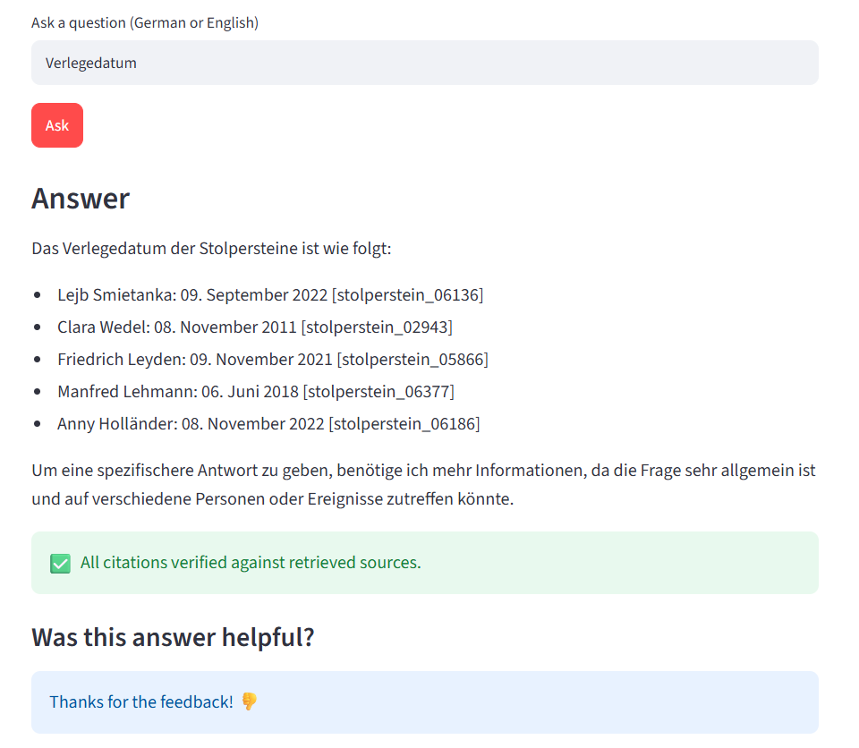
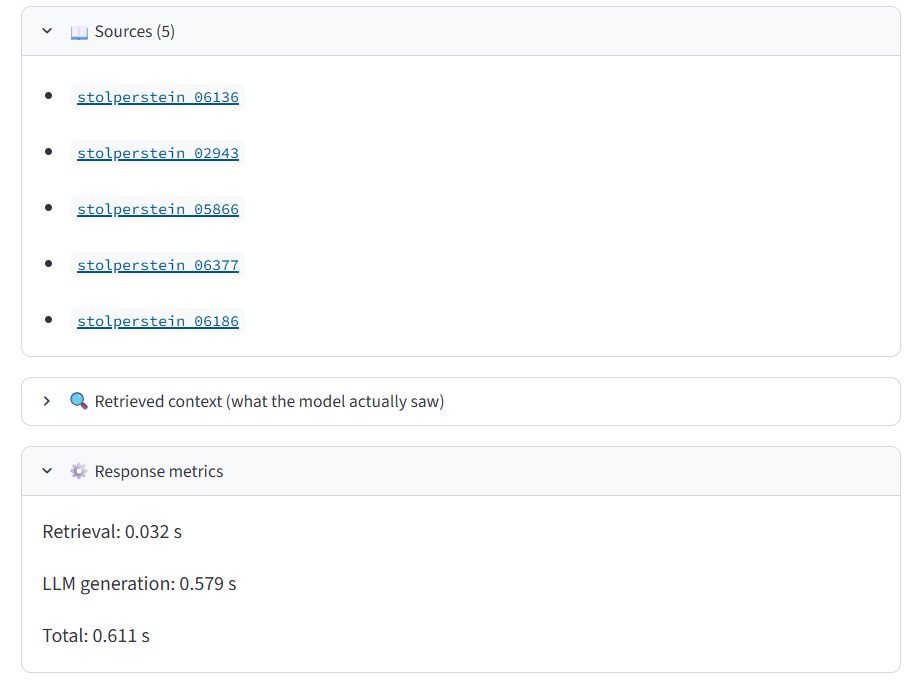
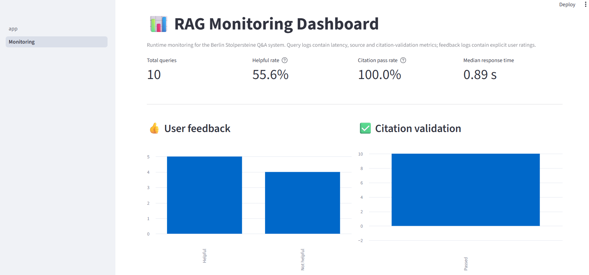
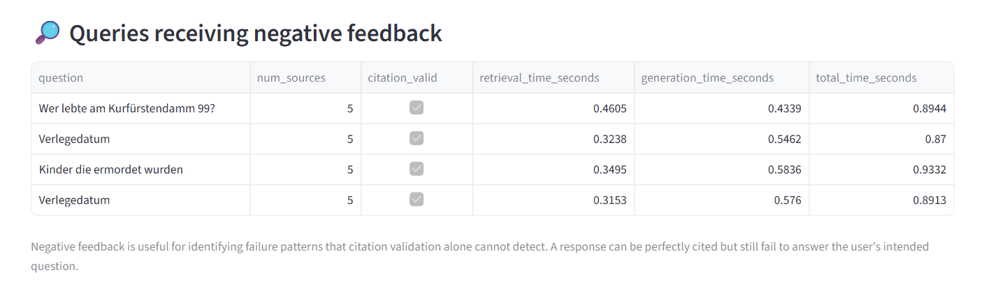

# Stolpersteine Berlin — RAG Q&A System

A question-answering system about the **Stolpersteine** ("stumbling stones") in Berlin — small memorial plaques placed outside the last freely chosen homes of victims of Nazi persecution. Ask a question in plain language and get an answer grounded in real records, with sources you can check.


---

## 1. The Problem

There are tens of thousands of Stolpersteine across Berlin, each with its own short biography: a name, dates, what happened to that person, and where they lived. This information is public but scattered across many individual web pages, split across Berlin's districts — there's no single place to search or ask questions about it.

This project builds a **RAG (Retrieval-Augmented Generation) system** that lets anyone ask natural questions — like *"Who was deported to Theresienstadt from Charlottenburg?"* — and get a short, grounded answer with citations pointing back to the real records, instead of having to manually search through hundreds of pages.

**Data covers 7 Berlin districts, 10,229 individual memorial records:**
Charlottenburg-Wilmersdorf, Mitte, Tempelhof-Schöneberg, Friedrichshain-Kreuzberg, Pankow, Steglitz-Zehlendorf, Neukölln.

### README Map

Where to find each rubric item in this README:

| Criteria | Where to look |
|---|---|
| Problem description | Section 1 |
| Retrieval flow (knowledge base + LLM) | Section 2 |
| Retrieval evaluation | Section 4 — Retrieval table |
| LLM evaluation | Section 4 — Generation + model choice |
| Interface | Section 6 (screenshots), Section 7 (run instructions) — Streamlit app |
| Ingestion pipeline | Section 3 — manual scripts, semi-automated |
| Monitoring | Section 5 + Section 6 dashboard screenshots — feedback + 5+ charts |
| Containerization | Section 7 — Dockerfile provided |
| Reproducibility | Section 7 — setup steps, dataset included, versions pinned via `uv.lock` |
| Best practices: hybrid search | Section 2 + Section 4 — evaluated and used |

---

## 2. How It Works (Architecture)



*Teal = retrieval, coral = generation, gray = entry/exit points.*

```
User question
     |
     v
Hybrid Retrieval
  BM25 (keyword search) + FAISS (semantic search), fused with RRF
     |  top 5 matching records
     v
LLM Generation
  Groq - llama-3.3-70b, strict "only use the given facts" prompt
     |
     v
Answer + citations + citation check
     |
     v
Streamlit app (chat UI + monitoring dashboard)
```

**Why hybrid search?** Keyword search (BM25) is great at exact names and street names. Semantic search (FAISS + embeddings) is great at understanding meaning even when wording differs. Combining both (via Reciprocal Rank Fusion) performs better than either alone — see evaluation results below.

---

## 3. Data Pipeline

1. **Scrape** — biography pages scraped per district (resumable, handles redirects)
2. **Filter & assign IDs** — records filtered per district, given a stable `stolperstein_id`
3. **Build documents** — each record turned into two text versions: a short "facts-only" version (used in LLM prompts) and a longer "facts + story" version (used for search ranking)
4. **Build indexes** — a BM25 keyword index and a FAISS vector index (using `multilingual-e5-small` embeddings, runs on CPU)
5. **Retrieve** — given a question, search both indexes and merge the results
6. **Generate** — send the top matches + question to the LLM with a strict prompt: only answer using the given facts, always cite sources, say "not enough information" if unsure
7. **Verify** — every citation in the answer is automatically checked against the real source IDs to catch made-up citations

> Note: the pipeline currently runs as a set of manual scripts rather than an automated pipeline (e.g. Airflow/dlt). Each step is independently re-runnable and resumable.

---

## 4. Evaluation

### Retrieval — which search method works best?

Tested on 11 hand-labeled questions across all 7 districts:

| Method | Precision | Recall | MRR | Hit Rate |
|---|---|---|---|---|
| BM25 only | 0.382 | 0.194 | 0.506 | 0.545 |
| Dense (FAISS) only | 0.400 | 0.216 | 0.636 | 0.818 |
| **Hybrid (BM25 + FAISS)** | **0.418** | **0.264** | **0.705** | **0.909** |

**Hybrid search wins clearly**, especially on MRR and hit rate (how often the right document shows up, and how high it ranks) — the metrics that matter most for a Q&A system. It also held up well as the dataset grew from 3 to 7 districts, while the individual methods got worse on their own.

Known weak spots: the system doesn't reliably use house numbers to narrow results, and it can confuse similar-sounding names and place names (e.g. "Therese" vs "Theresienstadt").

### Generation — are the answers trustworthy?

Used an LLM-as-judge to score answers on groundedness, citation accuracy, and appropriate hedging.

- 8 out of 9 test questions scored a perfect 5/5/5.
- The judge itself was checked first: it was given 5 deliberately broken answers (fake citations, wrong facts, missing hedges) and **correctly caught all 5** — so the perfect scores on real answers can be trusted, not just rubber-stamped.
- One known weak spot: when asked about a non-existent entity (e.g. a metadata field mistaken for a person's name), the system still lists plausible-sounding names before admitting there's no clear answer, instead of saying "not found" up front.

### Model choice — two LLMs compared

Two Groq-hosted models were evaluated for the generation step:

| Model | Result |
|---|---|
| `llama-3.3-70b-versatile` | Citations accurate and consistent; appropriately hedges on unclear questions |
| `gpt-oss-120b` (Groq's suggested newer model) | Citations frequently corrupted or malformed; answers were over-conservative, refusing to answer even when the retrieved context clearly supported one |

**`llama-3.3-70b-versatile` was kept** based on this comparison — a concrete evaluation, not a default choice, decided which model made it into the final system.

---

## 5. Monitoring

Every query is logged automatically: the question, which retrieval method was used, whether citations passed the check, and how long retrieval/generation took.

Users can give thumbs-up / thumbs-down feedback in the app, linked back to their exact question.

A second page in the app (**Monitoring Dashboard**) shows:
- Total queries, helpful rate, citation validity rate, median response time
- Charts for feedback, latency, sources per answer, answer length
- A list of negatively-rated questions, for spotting failure patterns

**Key finding from monitoring:** a valid, well-cited answer isn't automatically a *useful* one — some 100%-cited answers still didn't actually answer the user's question. This shaped how we think about the system's limits.

---

## 6. Screenshots

**Chat interface**



**A known limitation** — the system correctly hedges on a question about a non-entity, but still lists names before the caveat (see section 4 for details):





**Monitoring dashboard**



Note: the helpful rate above reflects a small early-testing sample (10 queries), not overall system accuracy — see Section 4 for the full retrieval evaluation (0.909 hit rate) and generation evaluation (8/9 perfect judge scores), which are based on a larger, dedicated evaluation set.

**Failure analysis view**



---

## 7. Running It

### Requirements
- Python (managed with `uv`)
- A [Groq API key](https://console.groq.com) (free tier works)

### Setup

```bash
git clone https://github.com/Benecia30/Stolpersteine-Berlin-rag.git
cd Stolpersteine-Berlin-rag
uv sync
cp .env.example .env   # add your GROQ_API_KEY (no quotes around the key)
```

### Build the indexes (first time only)

The dataset is already included in `data/raw/` (structured facts, CC-BY licensed) — no scraping needed. Just build the documents and indexes from it:

```bash
uv run scripts/04_build_documents.py
uv run scripts/05_build_bm25_index.py
uv run scripts/06_build_embeddings.py
```

> Re-scraping is optional and only needed if you want to refresh the data from the source site: `uv run scripts/02_filter_districts.py` then `uv run scripts/03_scrape_biographies.py`. This can take a while and hits the source website directly.

### Run the app

```bash
uv run streamlit run app.py
```

### Run with Docker (no local setup needed)

```bash
docker build -t stolpersteine-rag .
docker run -p 8501:8501 --env-file .env stolpersteine-rag
```

Then open `http://localhost:8501`.

---

## 8. Project Structure

```
scripts/               data pipeline (scrape -> filter -> build -> index)
utils/logger.py        query & feedback logging
app.py                  main Streamlit app
pages/2_Monitoring.py   monitoring dashboard
logs/                   query & feedback logs (JSONL)
eval_helpers/           judge calibration
Dockerfile
```

---

## 9. What's Not Included (and why)

To stay focused on a working, well-evaluated system before the deadline, the following were deliberately left out: re-ranking, query rewriting, agent/graph-based RAG, OCR, and swapping to a larger embedding model. These are natural next steps but weren't needed to answer the core project questions well.

**Future work:** the dataset currently covers 7 of Berlin's 12 districts (10,229 records). The remaining districts (e.g. Spandau, Reinickendorf, Marzahn-Hellersdorf, Lichtenberg, Treptow-Köpenick) can be added by re-running the same scrape → filter → index pipeline — the `stolperstein_id` assignment logic was specifically designed to support this without disturbing existing IDs (see the bug fix noted during the 3→7 district expansion).

---

## 10. Acknowledgements

Biographical data sourced from public Stolpersteine district records (CC-BY). Narrative biography text is excluded from this repository due to copyright; only structured facts are included.